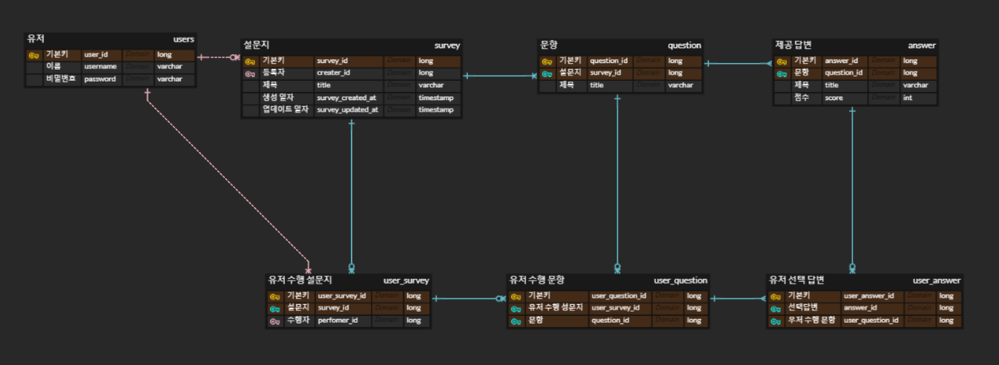

# ✔️ Project: Maeum

## 🎤 Maeum 소개

마음연구소의 과제테스트를 위해 제작한 설문조사 웹 서비스입니다.

## 📆 개발기간

2023.11.15 ~ 2023.11.21

## 🔍 주요 기능

1. 로그인, 회원가입
2. 설문지, 문항, 답변 CRUD

3. 설문지 수행, 수행한 문항, 답변 조회 및 수정 

## 📚 기술 스택

- typescript
- nest.js
- graphql
- typeorm
- postgresql

## 👉 서버 구동방법

백엔드

- @nestjs/cli 글로벌 설치
  - `npm install -g @nestjs/cli`
- nest.js 백엔드 디렉토리로 이동
  - `cd my-nest-app`
- package.json의 라이브러리들 설치
  - `npm install`

- 서버 구동
  - `npm start`

프론트엔드

- 진행중

## ✔️ 기타 문서

### 🎨 ERD

- user는 survey를 생성할 수 있으며 수행할 수도 있습니다.
  - survey 테이블이 user를 참조하게 하여 생성한 유저를 알 수 있습니다. 
  - user_survey 중계테이블을 만들어 user가 수행한 설문지들을 저장하였습니다.
- 제공답변은 여러개이나, 유저가 선택한 답변은 1~n개입니다.
  - user_answer 테이블이 answer을 참조하게 하여 사용자가 선택한 답변의 개수만큼 데이터가 저장되도록 구현하였습니다.
  - 이 부분은 question에 요구되는 답변의 개수만큼만 저장되도록 수정할 필요가 있습니다.

### 💡 API 명세서

[Postman API 명세서 링크](https://documenter.getpostman.com/view/25360580/2s9YeA9ZTZ)

[Notion API 명세서 링크](https://insidious-foundation-1a1.notion.site/b6223dccf1094bfa8d1e1dc760c050f8?v=ec40d30c3ce74af0abd73389bb8a20e4&pvs=4)

## 프로젝트에서 아쉬웠던 점

- nestjs를 처음 사용하여 구현에 있어서 시간이 많이 소요되었습니다. 프론트 개발까지 완성하지 못한점이 아쉽습니다.
- 빠르게 개발하다보니 entity자체를 request, reponse로 활용하였습니다. dto를 만들어 개발했다면 깔끔한 로직 구현을 할 수 있었을 것 같습니다.

- commit 기록을 제대로 작성하지 못하고 test코드가 아닌 postman으로 테스트를 했던점이 아쉽습니다. 처음 사용하는 프레임워크에서 코드의 문법에 익숙해지는 것이 먼저라고 생각되어 그랬지만, 이번 프로젝트 덕분에 다음 프로젝트에서는 제대로 개발 프로세스를 세울 수 있을 것 같습니다.
- jwt에서 userId를 추출하여 비지니스 로직에 사용할려고 하였습니다. middleware를 제작하여 request에 userId를 담을려고 하였으나 구현에 실패하였고, pathVariable로 userId를 받는 것으로 구현할 수 밖에 없었던 점이 아쉽습니다.

## 프로젝트에서 좋았던 점

- 비동기로 작동하는 nestjs의 특성상 async/await를 사용해야 했습니다. 이에 대해 조사해보며 단일스레드, 비동기 I/O 작업에 대한 이해도를 높일 수 있었던 점이 좋았습니다.
- 유저는 설문지를 생성할 수도 작성할 수도 있으며, 설문지에 있는 문항과 답변, 유저가 문항에서 선택한 답변 등 여러 복잡한 요구사항을 어떻게 관계를 맺어야 할지 고민이 많이 되었습니다. 개발을 하는 도중에 더 적절한 DB모델이 떠올랐고 3번 수정하며 구현하였습니다. 이 덕분에 DB 설계에 대한 이해도가 높아졌고, orm을 사용하여 데이터를 조작하는 역량을 더욱 향상시킬수 있었습니다.