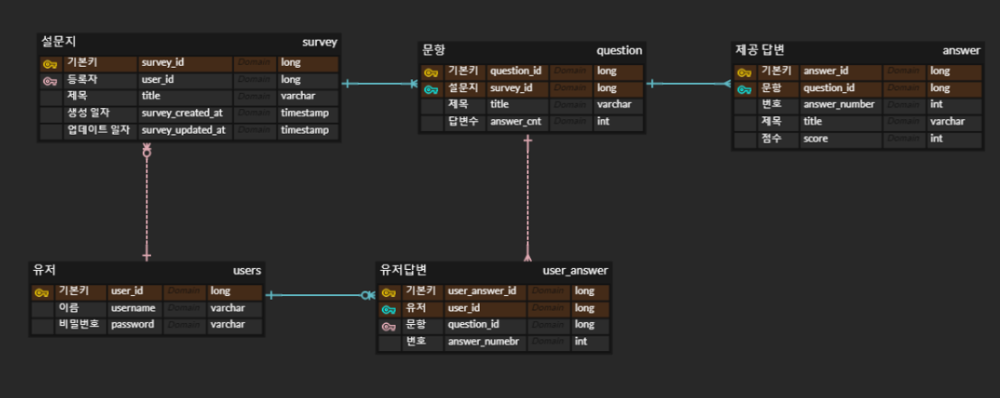
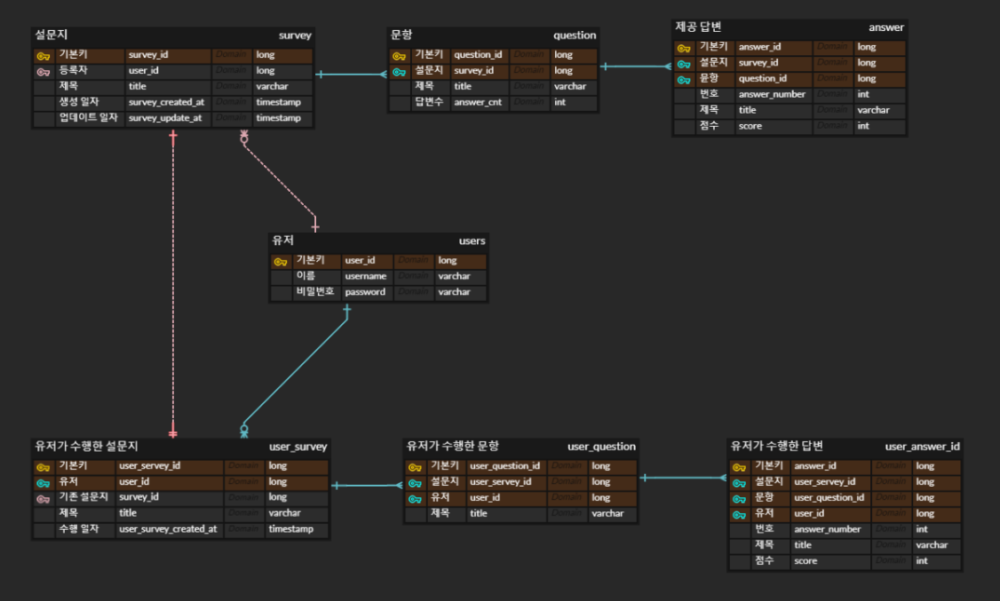

# 2. ERD 제작, 엔티티와 DB스키마 생성

[TOC]

### 0️⃣ 개요

**사용기술**

- 언어 - typescript

- 프레임워크 - nest.js
- ORM - typeorm
- 데이터베이스 - postgresql
- 프론트 - graphql


**이전**

- nest.js 백엔드 서버 세팅
  - DB연결, 디렉토리 구조 세팅


**목표**

- ERD 제작 (erdcloud)

- 엔티티 생성
- 데이터베이스 스키마 구축


**이후**

- API 본격 개발

- 프론트 개발


### 1️⃣ ERD 구조 후보리스트

1. 유저-유저가 수행한 설문지-설문지-문항-제공답변 구조

- 설문지의 이름과 총점만 출력한다.
- 장점
  - 문항, 답변이 update, delete되어도 그 당시했던 점수가 그대로 남아 데이터의 일관성을 지킬수 있음
- 단점
  - 유저가 수행했던 설문지의 상세내용을 볼 수 없음 (ex. 유저의 문항 답변)


2. 유저-설문지-문항-제공답변 구조

- 

- 장점
  - 유저가 수행했던 설문지의 상세내용을 볼 수 있음
- 단점
  - 설문지의 문항, 제공답변이 update시 데이터의 일관성을 지킬 수 없음
    - 이 부분을 설문지가 업데이트 되었다는 공지사항 기능을 추가할 수 있을 것 같음
  - 설문지가 삭제되면 유저는 수행했던 설문지를 조회할 수 없음


3. 유저가 답변한 설문지를 스냅샷 형태처럼 데이터베이스에 기록하는 erd

- 
- 장점
  - 설문지의 문항, 제공답변이 update시 수행 당시의 설문지를 조회하기 때문에 데이터의 일관성을 지킬 수 있음
  - 설문지 delete시에도 수행했던 설문지를 조회할 수 있음
- 단점
  - 너무 많은 데이터가 중복되어 저장됨


### 2️⃣ 선택 ERD


**선택이유**

- 설문지의 update, delete가 그렇게 자주 일어날 것 같지 않다.
  - 되더라도 공지사항을 통해 해결할 수 있을 것 같다.
- 사용자는 설문지 점수 뿐만 아니라 자신이 선택했던 답변도 보고싶을 것 같다.
  - 요구사항에 답변 CRUD기능이 포함되어있다.


**설문지 CRUD**

- 설문지 테이블로 문항, 제공답변 테이블을 join하여 생성
- 설문지를 삭제하면 문항, 제공답변은 on delete cascade

- 문항이나 제공답변 update시 trigger로 설문지의 업데이트 일자 update 및 공지사항 생성


**완료한 설문지 조회**

- 유저와 문항의 중계테이블 유저답변 테이블로 데이터 저장
- user_id로 모든 데이터 조회 이후 survey_id로 묶음
- question_id와 answer_number로 제공답변의 score를 계산


### 2️⃣ 엔티티 생성

0. 참고사항

- spring에서는 카멜케이스를 스네이크케이스로 자동변환해주었으나 nest.js는 일일히 설정해주거나 변환파일을 직접 생성해야함
- spring에서는 단방향 연관관계 매핑이 됬는데, nest.js에서는 되는지 모르겠음
- 엔티티를 생성하고 app.module.ts에 추가해주어야함


1. Users

- ```typescript
  import { Column, Entity, OneToMany, PrimaryGeneratedColumn } from 'typeorm';
  import { Survey } from './survey.entity';
  import { UserAnswer } from './user_answer.entity';
  
  @Entity()
  export class Users {
    
    @PrimaryGeneratedColumn({ name: 'user_id' })
    id: number;
  
    @OneToMany(() => Survey, (survey) => survey.user)
    surveys: Survey[]
  
    @OneToMany(() => UserAnswer, (user_answer) => user_answer.user)
    userAnswers: UserAnswer[]
  
    @Column()
    username: string;
  
    @Column()
    password: string;
  }
  ```

  - `Users`와 `Survey`는 일대다 관계
  - `Users`와 `UserAnswer`는 일대다 관계


2. Survey

- ```typescript
  import { Entity, Column, PrimaryGeneratedColumn, CreateDateColumn, UpdateDateColumn, ManyToOne, OneToMany, JoinColumn } from 'typeorm';
  import { Users } from './user.entity';
  import { Question } from './question.entity';
  
  @Entity()
  export class Survey {
  
      @PrimaryGeneratedColumn({ name: 'survey_id' })
      id: number;
  
      @ManyToOne(() => Users, (user) => user.surveys)
      @JoinColumn({ name: 'user_id' })
      user: Users;
  
      @OneToMany(() => Question, (question) => question.survey)
      questions: Question[];
  
      @Column()
      title: string;
  
      @CreateDateColumn({ name: 'created_at', type: 'timestamp', default: () => 'CURRENT_TIMESTAMP' })
      createdAt: Date;
  
      @UpdateDateColumn({ name: 'updated_at', type: 'timestamp', default: () => 'CURRENT_TIMESTAMP', onUpdate: 'CURRENT_TIMESTAMP' })
      updatedAt: Date;
  }
  ```

  - `Servey`와 `Users`는 다대일 관계
  - `Servey`와 `Question`은 일대다 관계


3. Question

- ```typescript
  import { Entity, Column, PrimaryGeneratedColumn, ManyToOne, OneToMany, JoinColumn } from 'typeorm';
  import { Survey } from './survey.entity';
  import { Answer } from './answer.entity';
  import { UserAnswer } from './user_answer.entity';
  
  @Entity()
  export class Question {
  
      @PrimaryGeneratedColumn({ name: 'question_id' })
      id: number;
  
      @ManyToOne(() => Survey, (survey) => survey.questions)
      @JoinColumn({ name: 'survey_id' })
      survey: Survey;
  
      @OneToMany(() => Answer, (answer) => answer.question)
      answers: Answer[];
  
      @OneToMany(() => UserAnswer, (userAnswer) => userAnswer.question)
      @JoinColumn({ name: 'user_answer_id' })
      userAnswers: UserAnswer[];
  
      @Column()
      title: string;
  
      @Column({ name: 'answer_cnt' })
      answerCnt: number;
  }
  ```

  - `Question`과 `Survey`는 다대일 관계
  - `Question`과 `Answer`는 일대다 관계
  - `Question`과 `UserAnswer`는 일대다 관계


4. Answer

- ```typescript
  import { Entity, Column, PrimaryGeneratedColumn, ManyToOne, JoinColumn } from 'typeorm';
  import { Question } from './question.entity';
  
  @Entity()
  export class Answer {
  
      @PrimaryGeneratedColumn({ name: 'answer_id' })
      id: number;
  
      @ManyToOne(() => Question, (question) => question.answers)
      @JoinColumn({ name: 'question_id' })
      question: Question;
  
      @Column({ name: 'answer_number' })
      answerNumber: string;
  
      @Column()
      title: string;
  
      @Column()
      score: number;
  }
  ```

  - `Answer`과 `Question`은 다대일 관계


5. UserAnswer

- ```typescript
  import { Entity, Column, PrimaryGeneratedColumn, ManyToOne, JoinColumn } from 'typeorm';
  import { Users } from './user.entity';
  import { Question } from './question.entity';
  
  @Entity()
  export class UserAnswer {
  
      @PrimaryGeneratedColumn({ name: 'user_answer_id' })
      id: number;
  
      @ManyToOne(() => Users, (user) => user.surveys)
      @JoinColumn({ name: 'user_id' })
      user: Users;
  
      @ManyToOne(() => Question, (question) => question.userAnswers)
      @JoinColumn({ name: 'question_id' })
      question: Question;
  
      @Column({ name: 'answer_number' })
      answerNumber: number;
  }
  ```

  - `UserAnswer`과 `Users`는 다대일 관계
  - `UserAnswer`과 `Question`은 다대일 관계


6. app.module.ts

- ```typescript
  @Module({
    imports: [
      TypeOrmModule.forRoot({
        // TypeORM 설정 옵션을 여기에 추가
        type: 'postgres',
        host: 'localhost',
        port: 5432,
        username: 'maeum',
        password: 'maeum',
        database: 'maeum',
        synchronize: true,
        entities: [Users, Survey, Question, Answer, UserAnswer],
      }),
      UserModule,
    ],
    controllers: [AppController],
    providers: [AppService],
  })
  export class AppModule {}
  ```

  - entities에 엔티티들 추가
  - synchronize로 DB스키마는 자동생성된다.


